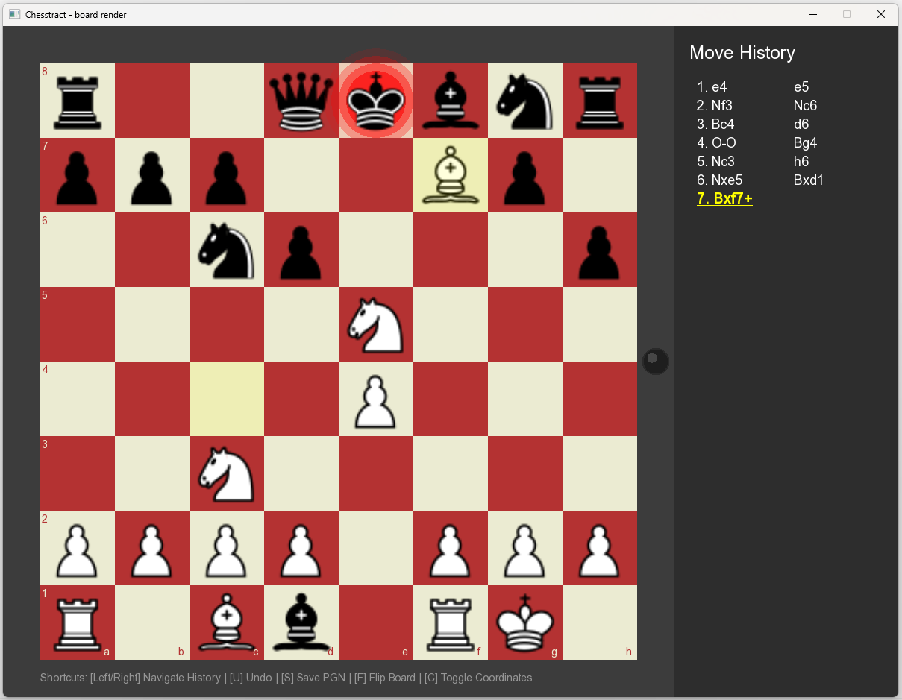

# Chesstract 

Chesstract is a desktop chess application built with **C++** and **SFML**. 

This project started as a personal journey to dive deep into C++, Object-Oriented Programming (OOP) principles, and game state management. What began as a simple grid has evolved into a fully functional chess board with time-traveling mechanics and PGN generation!

##  Current Features
* **Complete Chess Engine:** Supports all rules including Castling, En Passant, and Pawn Promotion.
* **Interactive UI:** Smooth Drag & Drop mechanics alongside traditional click-to-move functionality.
* **Time Travel:** Navigate through move history using arrow keys, or use the `Undo` feature to rewrite history.
* **PGN Export:** Generates standard PGN formats and exports them using a native Windows Save dialog.
* **Visual Polish:** Dynamic highlights for last moves, valid move dots, and pulsating danger zones when a King is in check.

## Roadmap (Future Plans)
* **Architecture Refactoring:** The current `Board` class handles both logic and rendering. The next big step is to decouple this into a strict `ChessEngine` (rules & math) and `GameUI` (graphics & input) architecture.
* **AI Opponent:** Implementing a basic chess bot to play against, starting with random valid moves and evolving into a piece-value evaluation algorithm.

## Built With
* C++20 (Modern C++ Standard)
* [SFML](https://www.sfml-dev.org/) (Simple and Fast Multimedia Library)
